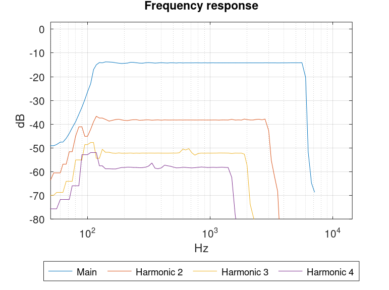

# Distortion analysis using "Farina Sweep" method.

"Farina Sweep" is a method for measuring impulse response and distortion with a single logarithmic sine sweep.  [[1]](#1).

Basic algorithm of Farina method is 
1. Generate logarithmic sweep excitation signal of known length, start and end frequency.
2. Play the signal and record the response.
3. Construct an inverse filter for the excitation signal and deconvolve the measured signal to get an impulse response.
4. Fundamentals and harmonics appear as distinct impulse peaks in the impulse response and can be extracted separately for further analysis.

This project is a demonstration of the core of this analysis method. It may be useful for learning and basis for further development. Written for [GNU Octave 8.3.0](https://octave.org/) but almost any version should work. Matlab should work also with minor modifications.

Filtering, frequency bin shifting, fading, smoothing, windowing methods etc. are often utilized with farina sweep to get cleaner results. See [[2]](#2) for some details. These methods are not used in the examples, except for the frequency response averaging to make plots. 

Copyright 2022 - 2024 Teemu Ikonen

# Examples

### example_impulse
`example_impulse()` Ideal case. implements a pure undistorted sweep signal deconvolution that produces an impulse.

### example_harmonics
`example_harmonics()` demonstrates analysis of an distorted signal. The example adds asymmetric clipping distortion in the signal that produces infinite number of odd and even harmonics and demonstrates how these harmonics fall on known delayed peaks in the impulse response.

### example_thd_analyze
`example_thd_analyze(T, fstart, fend, samplerate)` Total Harmonic Distortion (THD) analysis. Function accepts sweep duration, start and end frequency and the sample rate. It generates a sweep signal and adds known amount of 2nd, 3rd and 4th harmonics that should always produce 6.4% THD. This signal is then analyzed and results plotted.

    >> T = 1
    >> fstart = 100
    >> fend = 6000
    >> fs = 14400    
    >> example_thd_analyze(T, fstart, fend, fs);

")

### sample_analyze
`sample_analyze(T, fstart, fend, filename)` Read measured sample file and performs THD analysis. Analysis intermediate files and results are stored in out folder.

    >> filename = data/closed_loop.wav;
    >> sample_analyze(5, 20, 5500, filename);    
    Sample rate 44100Hz. Duration 5.06s
    Wrote out/deconvoluted_impulse_closed_loop.wav    
    Wrote out/data_closed_loop.csv

Data must start immediately in the samplefile. The sweep range must match match exactly the excitation sweep that was used to record the sample file. Wrong frequency skews the results.
 Here 50 was used starting frequency instead of correct 20.

### Bandwidth and Harmonics

Deconvolution with the inverse filter removes all frequencies beyond the end of the sweep frequency `fend`. Higher frequencies in the harmonics disappear. The sweep (and its inverse) must go further to higher frequencies to capture ever more higher frequency harmonics. Also sample rate `fs` must be high enough!

For example let end of sweep `fend` = 6000Hz and sample rate `fs` >= 12000Hz. The 2nd order harmonics end at 3000Hz, 3rd order at 2000Hz and so on. Increasing sample rate has no effect.

However this is not an major issue with audio where sweep end at 20kHz. Human ear can't really hear harmonics above that frequency. For example 2nd harmonics beyond 10kHz fundamental cannot be heard, 3rd harmonics beyond 6.7kHz and so on.

If you want to analyze 2nd harmonics up to e.g. 6000Hz you must generate the sweep up to 12000Hz (and use 24000Hz sample rate). If you want to analyze 3rd harmonics up to 6000Hz the sweep must be generated up to 3*6000 = 18000Hz and sample rate must be naturally twice that, 36000Hz. And so on. On measurement sweep signal needs to be played only up to fundamental end frequency (6000Hz in this example). Use function tfreqsinelog() to figure out when to stop. Another way would be to low pass filter the sweep signal before playback. The recording has to be full length to match the filter length. e.g. To analyze up to 6000hz a 1 second long sweep generated to 18000, the playback can be stopped at 0.7559s.

    >> tfreqsinelog(6000, 1, 200, 18000)
    ans = 0.7559    

## Library  functions
Examples are based on following functions.

### sinelog, isinelog
`y = sinelog(t, fstart, fend, samplerate)` and `isinelog(t, fstart, fend, samplerate)` generate a sweep and its inverse filter.

    >> T = 1
    >> f1 = 100
    >> f2 = 6000
    >> fs = 14400  
    >> t = [0: 1/fs: T];
    >> y = sinelog(t, T, f1, f2) * 0.5;
    >> plot(t,y);
    >>

### dbfft_smooth
`[freq, Xdb] = dbfft_smooth(x, fs, N)` Smoothed out frequency power spectrum in dB. Returns frequency points for Renard 40 frequencies up to sampling rate averaged over by N neighbouring octaves.

    >> [freq, Ydb] = dbfft_smooth(y, fs, 8);
    >> plot(freq, Ydb)
    >> set(gca, "xscale", "log");

### nthharmonic
`t = nthharmonic(N, T, f1, f2)` Returns the expected time delay for Nth harmonic for the given sweep parameters.

### extract_harmonic
`[hn, t1, t2] = extract_harmonic(T, f1, f2, Fs, h, N)` extracts the Nth harmonic impulse from the deconvolution result h. The t1 and t2 are the end and start times of the extracted pulse.

## References

<a id="1">[1]</a>  Angelo Farina, "Simultaneous measurement of impulse response and distortion with a swept-sine technique", AES 108th Convention 2000  February  19-22 Paris, France.
 
<a id="2">[2]</a>  Antonin Novak, Laurent Simon, Pierrick Lotton. Synchronized Swept-Sine: Theory, Application, and Implementation. Journal of the Audio Engineering Society, 2015, 63 (10), pp.786-798.
ff10.17743/jaes.2015.0071ff. ffhal-02504321.

